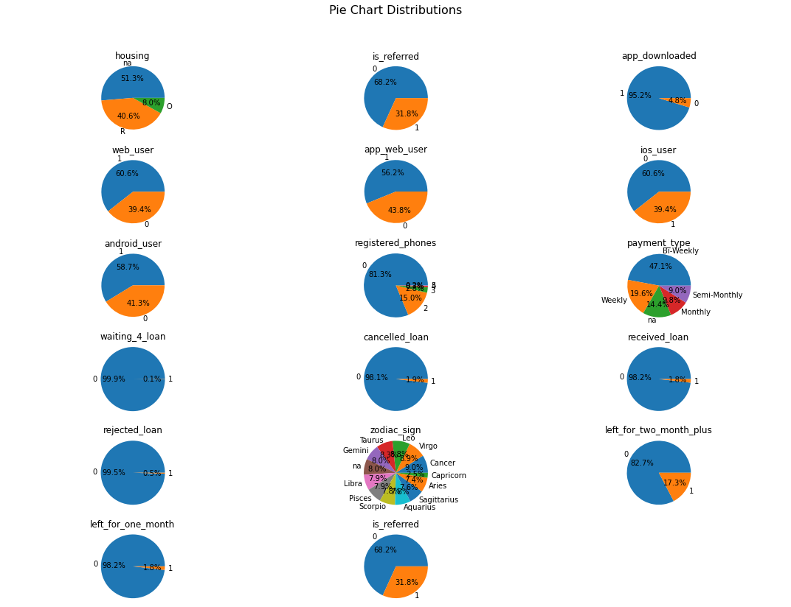

# Churn Rate Minimization
This repo consists of the Churn Rate Minimization Case Study from Super Data Science's course, Machine Learning Practical: 6 Real-World Applications.

## Problem Statement
The objective of this model is to predict which users are likely to Churn, so that the company can focus on Re-Engaging these users with the Product. These efforts can be email reminders about the Benefits of the Product, especially focusing on features that are new or that the User has shown to value.

## Model Used
The case study utilises Logistic Regression Model from the Scikit Learn Library, which is evaluated using K-Fold Cross Validation and later undergoes Feature Selection (Recursive Feature Elimination), to maintain a balance between the Accuracy and Number of Input Features.

## Libraries Used
- Pandas
- Numpy
- Matplotlib
- Seaborn
- Scikit Learn

## Visualisation of the data
*The following plot (Matplotlib Subplots) shows Histograms of the Features from the entire Dataset*
 
 

## Distribution of the Features
*The following plot (Matplotlib Subplots) shows the distribution of the various features of the Dataset, with the aid of Pie Charts*
 
 

## Correlation with Response Variable
*The following plot (Pandas Bar Plot) shows a measure of the Correlation of the features, with the Response Variable (Churn Likelihood of the User)*
 
 

## Correlation Among the Features
*The following plot (Seaborn Heatmap) shows the Correlation among the Features, with each other*
 
 

## Confusion Matrix (Without Feature Selection)
*The following plot (Seaborn Heatmap) shows the Confusion Matrix (Without Feature Selection) for the Test Set Results & the Predicted Results*
 
 

## Confusion Matrix (With Feature Selection)
*The following plot (Seaborn Heatmap) shows the Confusion Matrix (With Feature Selection) for the Test Set Results & the Predicted Results*
 
 
